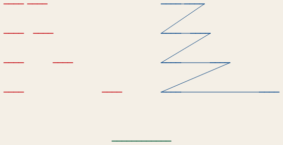
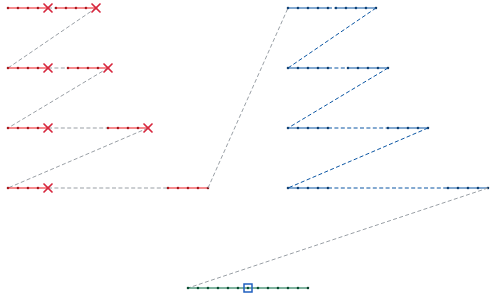
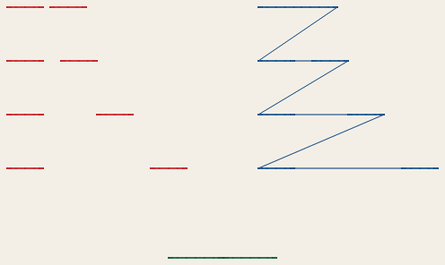
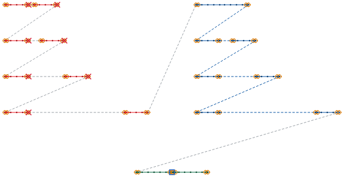
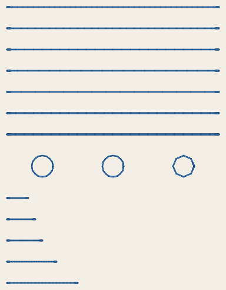
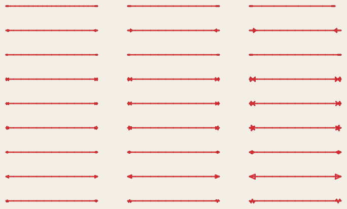
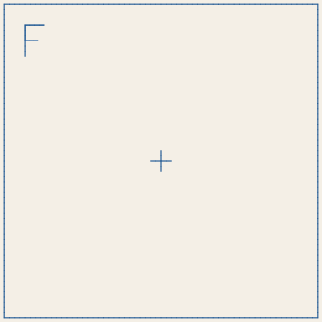
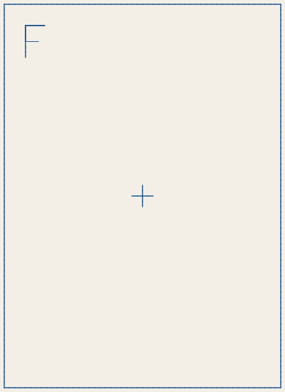
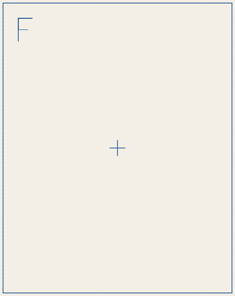

<!-- Generated by `cargo xtask docs` from `stitchcraft-engine/src/testsheets/` and the `stitch` shots in `docs/shots.toml`. Edit the source, not this page. -->

# Test sheets

Designs drawn in code for the [machine checkpoints](../../plan/machine-testing.md). Write one with `stitch testsheet <id> --profile brother-200x200 -o <id>.pes`; the command also prints what to check after sewing it, as listed here. The pictures are previews: they show what the machine will sew, including jump threads it leaves for you to cut.

## TS-01 — Orientation and scale

120.0 × 120.0 mm · 274 stitches, 7 jumps, 7 trims, 0 colour changes, 0 stops

Threads: Black.

After sewing, check:

- The F reads normally: not mirrored, not upside down, not turned.
- Each arm of the cross measures 100.0 ± 0.5 mm end to end, horizontally and vertically.
- The corner squares measure 10.0 mm on every side.
- Ticks are 10 mm apart; the long ticks mark the ends and the centre.

## TS-02 — Colour changes, a stop, jumps and trims

140.0 × 70.0 mm · 93 stitches, 17 jumps, 8 trims, 2 colour changes, 1 stop

Threads: Red, Blue, Emerald Green, Emerald Green (stop).

After sewing, check:

- The machine stops for red → blue and blue → green, and once more in the middle of the green line (the stop).
- Left half (red, trim-flagged jumps): for each row (gaps of 2, 5, 15, 40 mm, top to bottom), was the thread between the two dashes cut?
- Right half (blue, plain jumps): the same question for each row, and for the jumps between rows.
- Any loose loops, knots or bird's nests on the back, and where.

## TS-02B — TS-02 drawn as a design: trims elements ask for

140.0 × 70.0 mm · 230 stitches, 17 jumps, 8 trims, 2 colour changes, 1 stop

Threads: Red, Blue, Emerald Green, Emerald Green (stop).

After sewing, check:

- The machine stops for red → blue and blue → green, and once more in the middle of the green line (the stop).
- Left half (red; every dash but the last asks for a trim after it): for each row (gaps of 2, 5, 15, 40 mm, top to bottom), was the thread between the two dashes cut?
- Right half (blue; no trims): the 2 mm gap is sewn across. For the other rows, and between rows, was the jump thread cut?
- Where the thread was cut, the stitching ends and starts again with a small lock: pull each tail gently. Does the dash hold?
- Any loose loops, knots or bird's nests on the back, and where.

## TS-03 — Running stitch: lengths, bean stitch, curves, the shortest stitch

60.0 × 78.0 mm · 596 stitches, 15 jumps, 15 trims, 0 colour changes, 0 stops

Threads: Blue.

After sewing, check:

- Running stitch lines (top five; 1.5, 2.0, 2.5, 3.0 and 4.0 mm): the stitches of each line are even; ten stitches measure 15, 20, 25, 30 and 40 mm.
- Bean stitch lines (next two; each stitch sewn three and five times): solid and raised, with no gaps.
- Circles (6 mm across; tolerance 0.1, 0.2 and 0.5 mm, left to right): round, with fewer and straighter stitches to the right.
- Short stitches placed by hand (bottom five; 0.3, 0.4, 0.5, 0.7 and 1.0 mm): which lines sew cleanly, with no thread breaks, knots or bunching on the back? The shortest clean one is the machine's shortest stitch.

## TS-04 — Lock stitches: do they hold, and do they show?

110.0 × 64.5 mm · 600 stitches, 27 jumps, 27 trims, 0 colour changes, 0 stops

Threads: Red.

After sewing, check:

- Rows, top to bottom: half stitch, arrow, back and forth, bowtie, cross, star, simple, triangle, zigzag. Each line has its lock at both ends and was trimmed after: pull each tail gently. Does the lock hold, or does the line come undone?
- Columns, left to right, are small, medium and large: the half stitch on first stitches of 1.5, 2.5 and 4 mm, back and forth at 0.5, 0.7 and 1.0 mm, the others at 70, 100 and 150 %.
- Which locks show from the front, and how much (1 hidden to 5 obvious)?
- Any thread breaks or knots at the locks, and where.

## TS-10A — Hoop size: 150 × 150 mm frame

150.0 × 150.0 mm · 275 stitches, 4 jumps, 4 trims, 0 colour changes, 0 stops

Threads: Blue.

After sewing, check:

- The machine accepts the file and shows the design.
- The frame measures 150.0 × 150.0 mm (± 0.5 mm).

## TS-10B — Hoop size: 190 × 150 mm frame

190.0 × 150.0 mm · 307 stitches, 4 jumps, 4 trims, 0 colour changes, 0 stops

Threads: Blue.

After sewing, check:

- The machine accepts the file and shows the design (StitchCraft warns that it is larger than the comfort zone — expected).
- The frame measures 190.0 × 150.0 mm (± 0.5 mm), wide side left to right, the F at the top left.

## TS-10C — Hoop size: 150 × 190 mm frame

150.0 × 190.0 mm · 307 stitches, 4 jumps, 4 trims, 0 colour changes, 0 stops

Threads: Blue.

After sewing, check:

- The machine accepts the file and shows the design (StitchCraft warns that it is larger than the comfort zone — expected).
- The frame measures 150.0 × 190.0 mm (± 0.5 mm), tall side top to bottom, the F at the top left.
