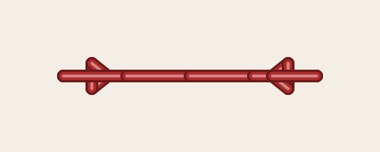
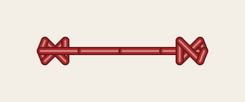
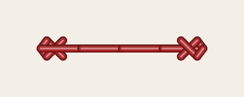
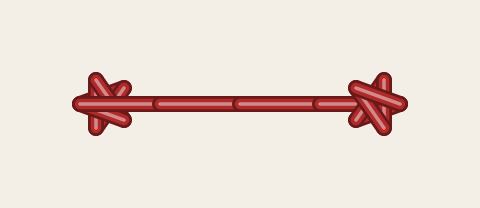
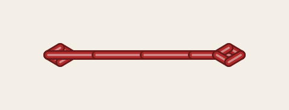
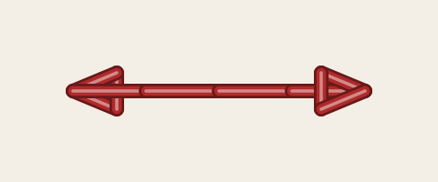
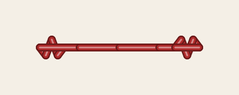
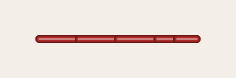

# Lock stitches, trims and stops

A lock, or tie, is a few small stitches where stitching starts (the tie-in) or ends (the tie-off). It
stops the thread from pulling out when the machine cuts it or jumps to the next part. StitchCraft adds
the locks an element's settings call for, and a trim or a stop after an element that sets `trim_after` or
`stop_after`.

## Where locks go

The needle sews straight on from one part of a design to the next when nothing separates them: the same
thread, and a gap of at most 3 mm (the collapse length) or the element's `min_jump_stitch_length_mm`.
There it sews no locks. Anywhere else the stitching ends with a tie-off, the needle jumps, and the next
part starts with a tie-in.

- `ties` chooses which ends get a lock. By default both ends do. It can also choose the start or the
  end alone, or neither.
- `force_lock_stitches` adds the tie-off at the end of each part, even where the next part is close
  enough to sew on.
- Manual stitch gets locks only when `force_lock_stitches` is set, because its needle points are placed
  by hand.

## Lock shapes

`lock_start` and `lock_end` choose the shape at each end. The default, the half stitch, goes forth and
back twice over half the first stitch, and the stitching covers it. `back_forth` does the same over steps
of `lock_start_scale_mm` and `lock_end_scale_mm`, 0.7 mm by default.

The drawn shapes are larger. `lock_start_scale_percent` and `lock_end_scale_percent` size
them, 100 % by default. Each picture shows an 8 mm line with the shape at both ends:

<!-- shot: lock-drawn -->
| arrow | bowtie | cross | star |
|:-:|:-:|:-:|:-:|
|  |  |  |  |
<!-- /shot -->

<!-- shot: lock-drawn-2 -->
| simple | triangle | zigzag | half_stitch |
|:-:|:-:|:-:|:-:|
|  |  |  |  |
<!-- /shot -->

The shapes are StitchCraft's own designs, sized to hide under the stitching they secure. A file from
Ink/Stitch that names a shape gets StitchCraft's shape of that name.

A custom lock (`custom`) is your own steps, written in `lock_custom_start` and `lock_custom_end` as
numbers in sizes of the scale in millimetres. Positive steps go into the stitching. `1 -1 1 -1` goes forth
and back twice, as `back_forth` does. The steps follow the stitching round its corners.

Every lock stitch is at least 0.2 mm long, to keep the needle out of the hole it has just left.
StitchCraft lengthens a step or enlarges a drawn lock that would be smaller, and `SC-W0502` says so.

## Trims and stops

- `trim_after` cuts the thread after the element, with a tie-off before the cut.
- `stop_after` pauses the machine after the element, while you place appliqué fabric or check the
  work. When the design has a stop position, the frame moves there before each stop.

A PES file marks a trim on the jump after it. Some Brother machines are reported to ignore that mark, and
test sheet TS-02 checks what the reference machine does. DST has no trim command. StitchCraft writes a trim
there as 3 short jumps that end where they started, and a DST machine set to cut at 3 jumps in a row
cuts there. The [machine formats](../../design/formats.md) design says how each format records a trim.

## Parameters

[Common parameters](../reference/params/common.md) lists each of these settings with its range and
default.
