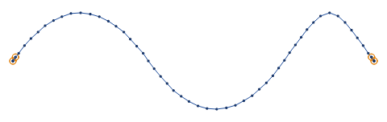
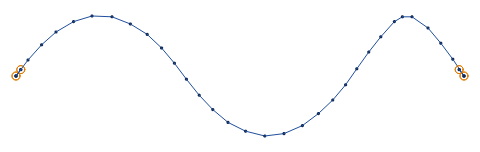
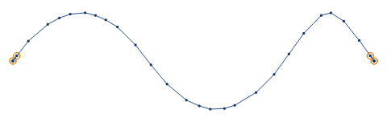
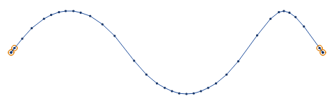
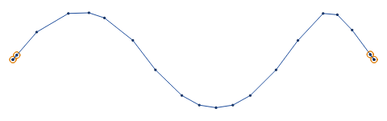
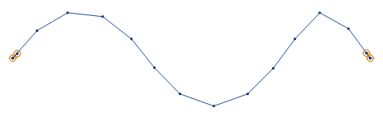
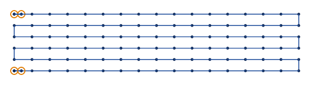
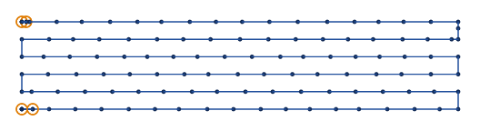
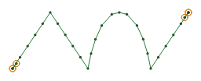
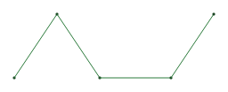

# Running stitch

A running stitch is a line of single stitches along a path. StitchCraft sews each stroke of an SVG design
with it, unless the stroke's `stroke_method` names another stitch. Use it for outlines, fine details and
lettering at small sizes.

The pictures on this page are drawn by StitchCraft's own engine and renderer, from the designs in
`docs/fixtures/`. Each dot is a needle point, and orange rings mark the lock stitches at each end. Each
parameter is set per element, and [setting parameters](README.md#setting-parameters) says what
`stitch plan` reads today.

## Stitch length

`running_stitch_length_mm` sets how long each stitch is, 2.5 mm by default. Between 2 corners the stitches
are spread evenly, and none is longer than the stitch length.

<!-- shot: running-length -->
| 1.5 mm | 2.5 mm | 4 mm |
|:-:|:-:|:-:|
|  |  |  |
<!-- /shot -->

Short stitches follow a curve closely and make more needle holes. Long stitches are quicker to sew and
show more of each stitch. With a list of lengths, such as `2.5 1`, the stitches take the lengths one after another along the
path.

## Corners and curves

Where the path turns by more than 30°, StitchCraft puts a needle point on the corner, and the line keeps
its shape. Along a curve, a stitch strays from the curve by at most `running_stitch_tolerance_mm`, 0.2 mm
by default. With a long stitch length the tolerance shows: here the stitches are 6 mm long.

<!-- shot: running-tolerance -->
| 0.1 mm | 0.5 mm | 2 mm |
|:-:|:-:|:-:|
|  |  |  |
<!-- /shot -->

At 2 mm the stitches cut across the curve. At 0.1 mm StitchCraft shortens them where the curve bends.

## Bean stitch and repeats

`bean_stitch_repeats` sews each stitch more than once, for a bolder line. At 1 each stitch is sewn 3
times, there, back and there again, and at 2 it is sewn 5 times. With a list such as `1 0`, the stitches
alternate between bold and plain.

`repeats` sews the whole path more than once. At 2 the needle goes there and back, and at 3 there, back
and there again. With an even number the stitching ends where it started.

## Random stitch length

Rows of running stitch close together line their needle points up across the rows, and the eye sees
stripes. `enable_random_stitch_length` varies each stitch's length by up to
`random_stitch_length_jitter_percent`, 10 % by default, and the stripes go.

<!-- shot: random-length -->
| even | random |
|:-:|:-:|
|  |  |
<!-- /shot -->

The stitching still ends on each corner. `random_seed` sets where the random lengths start. The same
element and seed give the same stitches every time, on every computer.

## Manual stitch

With `stroke_method` set to `manual_stitch`, each node of the path is a needle point and nothing else is.
A curve gives only its end node. Use it to place stitches by hand, or to sew a stitch file that was
traced as a path.

<!-- shot: manual -->
| running stitch | manual stitch |
|:-:|:-:|
|  |  |
<!-- /shot -->

`max_stitch_length_mm` splits a hand-placed stitch that is longer into equal parts. Bean stitch applies
to manual stitch, and repeats do not.

## The shortest stitch

A stitch shorter than the shortest stitch the machine sews well hammers one hole. StitchCraft never sews
one. The shortest stitch is the machine profile's, 0.3 mm on the reference Brother, or the element's own
`min_stitch_length_mm` when that is longer. A part of the path too short for a stitch is left out, and
`SC-W0401` names it. A stitch length below twice the shortest stitch is raised to that, and `SC-W0402`
says so.

## Parameters

The reference lists each parameter with its range and default, on a page for each group:

- [running stitch](../reference/params/running.md)
- [repeats and bean stitch](../reference/params/repeat.md)
- [manual stitch](../reference/params/manual.md)
- [the stroke method](../reference/params/stroke.md)
