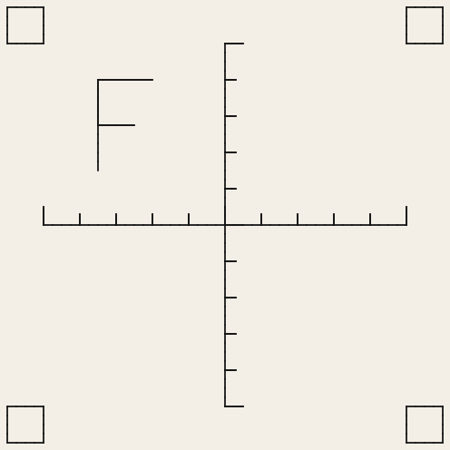

# Your first sew-out on a Brother

You will sew StitchCraft's orientation and scale sheet, TS-01, on a Brother machine with a 200 × 200 mm
hoop, and check that its size and direction are exactly right. It takes about twenty minutes.

## You need

- StitchCraft, [installed](../install.md).
- A Brother embroidery machine that reads PES files from a USB stick, and its 200 × 200 mm hoop.
- Medium-weight woven cotton, medium tear-away stabilizer, a 75/11 embroidery needle, 40 wt polyester
  thread (black shows the lines best), white bobbin thread.
- A ruler or calipers with millimetres.

## 1. Write the file

```console
{{#include ../reference/generated/testsheet-ts-01.txt}}
```

That is real output: this page is regenerated from StitchCraft itself, so the checksum is the one your
file will have. The checksum is how a sew-out report names exactly the bytes that were sewn. Every test
sheet is in the [test sheets reference](../reference/test-sheets.md); `stitch testsheet --list` lists
them too.

## 2. Look at it first

```console
{{#include ../reference/generated/preview-ts-01.txt}}
```



The picture is drawn from the file itself, at the exact positions the machine will use, so this is what
you should see in the hoop. Add `--style simple` to see every stitch, needle hole, trim and jump instead:
the way to check a design before you sew it.

## 3. Load it on the machine

Copy `TS-01.pes` to a USB stick, plug it into the machine and select the design. The machine should show
it at 120 × 120 mm, with an upright "F" in the top-left quarter. If it does not list the file at all,
stop here and report that — it is the most important thing this sheet tests.

## 4. Hoop and sew

Hoop the fabric and stabilizer drum-tight, centre the design, attach the hoop, and sew. The machine sews
the cross first, then the "F", then the four corner squares, trimming between parts if it can.

## 5. Check

Measure the sew-out against the [TS-01 checks](../reference/test-sheets.md#ts-01--orientation-and-scale).
`stitch testsheet` printed the same list when it wrote the file.

## 6. Tell us

File a **Sew-out report** on GitHub with photos of the front and back (a ruler in view), your measurements,
and anything odd ([machine testing](../../plan/machine-testing.md)).
